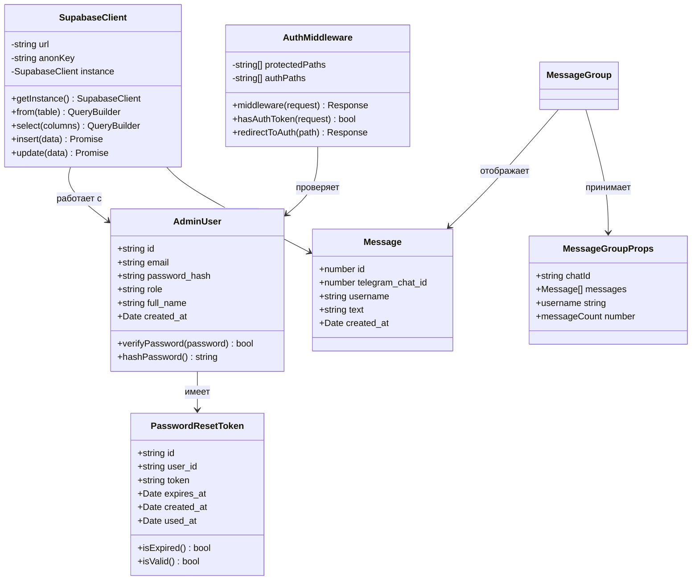
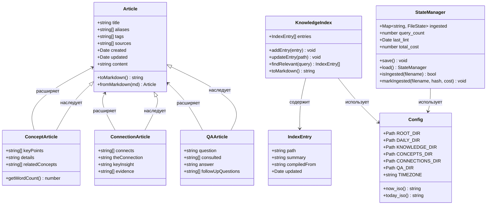
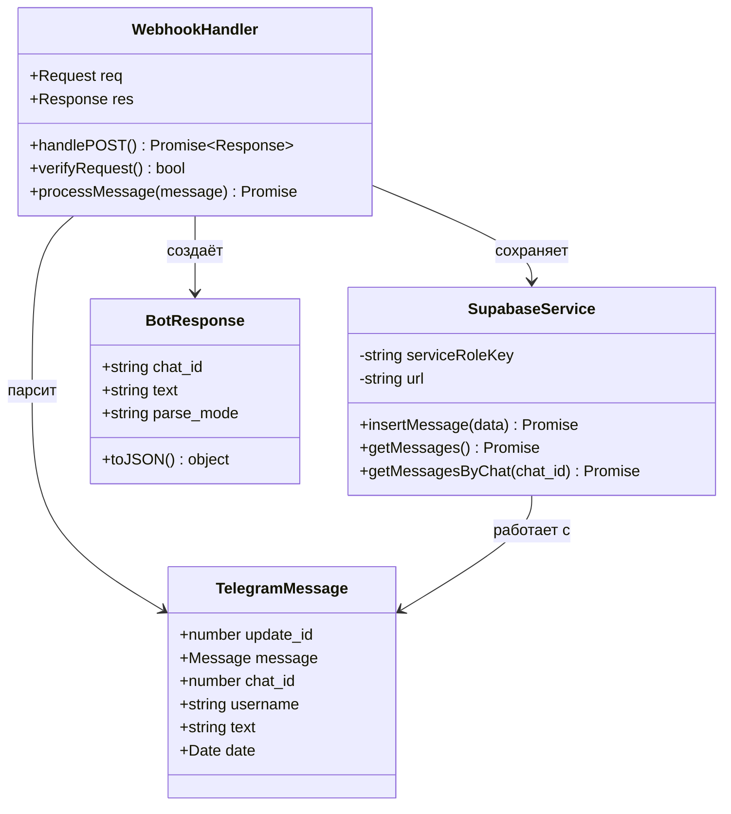

# C4 Диаграммы — VibecodeSupportBot

Полный набор C4 диаграмм по стандарту: System Context → Container → Component → Code.

---

## Уровень 1: System Context Diagram (Контекстная диаграмма системы)

Показывает VibecodeSupportBot в контексте его окружения и внешних зависимостей.

```mermaid
graph TB
    UserAdmin["👨‍💼 Администратор<br/>(Менеджер поддержки)"]
    UserTelegram["👤 Пользователь Telegram"]
    AI["🤖 AI Ассистент<br/>(Claude Code)"]

    subgraph "VibecodeSupportBot System"
        SupportAdmin["🖥️ Support Admin<br/>Админ-панель поддержки"]
        TelegramBot["📱 Telegram Bot<br/>Бот поддержки"]
        KnowledgeBase["📚 Knowledge Base<br/>База знаний проекта"]
    end

    subgraph "External Systems"
        Supabase["🗄️ Supabase<br/>БД + Auth + Edge Functions"]
        Vercel["☁️ Vercel<br/>Хостинг Next.js"]
        TelegramAPI["💬 Telegram Bot API<br/>Мессенджер"]
        GoogleOAuth["🔐 Google OAuth<br/>Аутентификация"]
    end

    UserAdmin -->|"Управляет через HTTPS| SupportAdmin
    UserTelegram -->|"Отправляет сообщения| TelegramBot
    AI -->|"Компилирует знания| KnowledgeBase
    
    SupportAdmin -->|"Читает/записывает данные| Supabase
    TelegramBot -->|"Принимает webhook| TelegramAPI
    TelegramBot -->|"Сохраняет сообщения| Supabase
    SupportAdmin -->|"Авторизация через| GoogleOAuth
    SupportAdmin -.->"|Развёрнут на| Vercel
    TelegramBot -.->"|Edge Function на| Supabase
    
    KnowledgeBase -.->"|Документирует| SupportAdmin
    KnowledgeBase -.->"|Документирует| TelegramBot

    classDef userStyle fill:#e1f5ff,stroke:#1976d2,color:#0d47a1
    classDef systemStyle fill:#85bbf9,stroke:#0d47a1,color:#fff
    classDef externalStyle fill:#c9b3f9,stroke:#512da8,color:#311b92
    classDef aiStyle fill:#a8e6cf,stroke:#2e7d32,color:#1b5e20
    
    class UserAdmin,UserTelegram userStyle
    class SupportAdmin,TelegramBot,KnowledgeBase systemStyle
    class Supabase,Vercel,TelegramAPI,GoogleOAuth externalStyle
    class AI aiStyle
```

---

## Уровень 2: Container Diagram (Диаграмма контейнеров)

Детализирует технологический стек и взаимодействие контейнеров внутри системы.

```mermaid
graph TB
    UserAdmin["👨‍💼 Администратор"]
    UserTelegram["👤 Пользователь Telegram"]

    subgraph "Vercel Platform"
        NextJS["🌐 Next.js Application<br/>support-admin<br/>React 19 + TypeScript<br/>Port: 3000"]
    end

    subgraph "Supabase Cloud"
        EdgeFunction["⚡ Edge Function<br/>telegram-webhook<br/>Deno Runtime"]
        Postgres["🗃️ PostgreSQL Database<br/>messages, admin_users,<br/>password_reset_tokens"]
        SupabaseAuth["🔐 Supabase Auth<br/>JWT + RLS Policies"]
    end

    subgraph "Knowledge Base"
        ClaudeHooks["🔄 Claude Hooks<br/>session-start/end,<br/>pre-compact"]
        PythonScripts["🐍 Python Scripts<br/>compile, query, lint,<br/>flush"]
        WikiFiles["📝 Wiki Files<br/>Vibecoding_Incubator/<br/>daily/, knowledge/"]
    end

    subgraph "External APIs"
        TelegramAPI["💬 Telegram API"]
        GoogleOAuth["🔐 Google OAuth"]
    end

    UserAdmin -->|"HTTPS<br/>Просмотр сообщений,<br/>управление| NextJS
    UserTelegram -->|"Отправляет сообщения| TelegramAPI
    TelegramAPI -->|"POST webhook<br/>JSON payload| EdgeFunction
    
    EdgeFunction -->|"INSERT via<br/>service_role key| Postgres
    NextJS -->|"SELECT via<br/>anon key + RLS| Postgres
    NextJS -->|"Auth checks<br/>JWT validation| SupabaseAuth
    NextJS -->|"OAuth callback| GoogleOAuth
    
    ClaudeHooks -->|"Извлекают знания<br/>из сессий| PythonScripts
    PythonScripts -->|"Компилируют<br/>в markdown| WikiFiles
    
    NextJS -.->"|Документируется| WikiFiles
    EdgeFunction -.->"|Документируется| WikiFiles

    classDef userStyle fill:#e1f5ff,stroke:#1976d2,color:#0d47a1
    classDef nextjsStyle fill:#bbdefb,stroke:#1976d2,color:#0d47a1
    classDef supabaseStyle fill:#b2dfdb,stroke:#00796b,color:#004d40
    classDef kbStyle fill:#c8e6c9,stroke:#2e7d32,color:#1b5e20
    classDef externalStyle fill:#ffe0b2,stroke:#f57c00,color:#e65100
    
    class UserAdmin,UserTelegram userStyle
    class NextJS nextjsStyle
    class EdgeFunction,Postgres,SupabaseAuth supabaseStyle
    class ClaudeHooks,PythonScripts,WikiFiles kbStyle
    class TelegramAPI,GoogleOAuth externalStyle
```

---

## Уровень 3: Component Diagram (Диаграмма компонентов)

Внутренняя структура ключевых контейнеров: Support Admin и Knowledge Base.

### 3.1 Support Admin Components

```mermaid
graph TB
    subgraph "Next.js Application"
        subgraph "API Routes"
            AuthLogin["🔑 /api/auth/login<br/>Email/Password auth"]
            AuthLogout["🚪 /api/auth/logout<br/>Clear cookie"]
            AuthGoogle["🌐 /api/auth/google<br/>OAuth callback"]
            AuthForgot["📧 /api/auth/forgot-password<br/>Reset token generation"]
            AuthReset["🔒 /api/auth/reset-password<br/>Password update"]
            ManagersAPI["👥 /api/admin/managers<br/>CRUD operations"]
        end

        subgraph "Pages (App Router)"
            SignIn["📝 /auth/sign-in<br/>Login form"]
            ForgotPage["📧 /auth/forgot-password<br/>Forgot password form"]
            ResetPage["🔒 /auth/reset-password<br/>New password form"]
            Dashboard["📊 /dashboard<br/>Main dashboard"]
            MessagesPage["💬 /dashboard/messages<br/>Support messages viewer"]
            UsersPage["👤 /dashboard/users<br/>Telegram users management"]
            ManagersPage["👥 /dashboard/managers<br/>Managers management"]
        end

        subgraph "UI Components"
            SigninForm["🔐 SigninWithPassword<br/>Form component"]
            GoogleBtn["🌐 GoogleSigninButton<br/>OAuth button"]
            MessageGroup["📦 MessageGroup<br/>Accordion by chat_id"]
            Sidebar["📱 Sidebar<br/>Navigation menu"]
            Header["🎯 Header<br/>Top bar with user info"]
        end

        subgraph "Libraries"
            SupabaseClient["🔧 Supabase Client<br/>@supabase/supabase-js<br/>singleton instance"]
            AuthMiddleware["🛡️ Middleware<br/>Cookie-based auth<br/>route protection"]
        end
    end

    subgraph "PostgreSQL Database"
        MessagesTable["📊 messages table<br/>id, telegram_chat_id,<br/>username, text, created_at"]
        AdminUsersTable["👤 admin_users table<br/>id, email, password_hash,<br/>role, full_name"]
        ResetTokensTable["🎫 password_reset_tokens<br/>id, user_id, token,<br/>expires_at, used_at"]
    end

    AuthLogin -->|"bcryptjs<br/>password_hash| AdminUsersTable
    AuthGoogle -->|"OAuth flow| AdminUsersTable
    AuthForgot -->|"Generates token| ResetTokensTable
    AuthReset -->|"Validates token,<br/>updates password| AdminUsersTable
    ManagersAPI -->|"CRUD operations| AdminUsersTable
    
    MessagesPage -->|"SELECT * FROM<br/>messages ORDER BY| MessagesTable
    UsersPage -->|"SELECT DISTINCT<br/>telegram_chat_id| MessagesTable
    
    SignIn -->|"POST to| AuthLogin
    ForgotPage -->|"POST to| AuthForgot
    ResetPage -->|"POST to| AuthReset
    Dashboard -->|"Uses| AuthMiddleware
    MessagesPage -->|"Uses| AuthMiddleware
    UsersPage -->|"Uses| AuthMiddleware
    ManagersPage -->|"Uses| AuthMiddleware
    
    SigninForm -->|"Used by| SignIn
    GoogleBtn -->|"Used by| SignIn
    MessageGroup -->|"Renders in| MessagesPage
    Sidebar -->|"Layout for| Dashboard
    Header -->|"Layout for| Dashboard
    
    MessagesPage -->|"Uses| SupabaseClient
    UsersPage -->|"Uses| SupabaseClient
    ManagersPage -->|"Uses| SupabaseClient

    classDef apiStyle fill:#ffe0b2,stroke:#f57c00,color:#e65100
    classDef pageStyle fill:#bbdefb,stroke:#1976d2,color:#0d47a1
    classDef componentStyle fill:#c8e6c9,stroke:#2e7d32,color:#1b5e20
    classDef libStyle fill:#e1bee7,stroke:#7b1fa2,color:#4a148c
    classDef tableStyle fill:#b2dfdb,stroke:#00796b,color:#004d40
    
    class AuthLogin,AuthLogout,AuthGoogle,AuthForgot,AuthReset,ManagersAPI apiStyle
    class SignIn,ForgotPage,ResetPage,Dashboard,MessagesPage,UsersPage,ManagersPage pageStyle
    class SigninForm,GoogleBtn,MessageGroup,Sidebar,Header componentStyle
    class SupabaseClient,AuthMiddleware libStyle
    class MessagesTable,AdminUsersTable,ResetTokensTable tableStyle
```



### 3.2 Knowledge Base Components

```mermaid
graph TB
    subgraph "Claude Code Session"
        SessionStart["🚀 session-start.py<br/>Inject knowledge<br/>into session context"]
        SessionEnd["🏁 session-end.py<br/>Capture transcript<br/>on session close"]
        PreCompact["💾 pre-compact.py<br/>Save context before<br/>auto-compaction"]
    end

    subgraph "Memory Processing"
        Flush["🧠 flush.py<br/>Extract knowledge<br/>from conversations"]
        Compile["📝 compile.py<br/>Compile daily logs<br/>to wiki articles"]
        Query["❓ query.py<br/>Index-guided<br/>retrieval (no RAG)"]
        Lint["✅ lint.py<br/>7 health checks<br/>structural + LLM"]
    end

    subgraph "Data Storage"
        DailyLogs["📅 daily/<br/>YYYY-MM-DD.md<br/>Append-only logs"]
        KnowledgeIndex["📚 knowledge/index.md<br/>Master catalog<br/>of all articles"]
        Concepts["💡 knowledge/concepts/<br/>Atomic knowledge<br/>articles"]
        Connections["🔗 knowledge/connections/<br/>Cross-cutting insights"]
        QA["❔ knowledge/qa/<br/>Filed query answers"]
    end

    subgraph "Automation"
        GitHook["🔧 Git post-commit hook<br/>auto-log-to-wiki.ps1<br/>Log code changes"]
        TaskScheduler["⏰ Windows Task Scheduler<br/>auto-lint.ps1<br/>Daily at 22:00"]
    end

    SessionStart -->|"Reads| KnowledgeIndex
    SessionEnd -->|"Spawns| Flush
    PreCompact -->|"Spawns| Flush
    
    Flush -->|"Appends to| DailyLogs
    Compile -->|"Reads| DailyLogs
    Compile -->|"Creates/Updates| Concepts
    Compile -->|"Creates/Updates| Connections
    Compile -->|"Creates/Updates| QA
    Compile -->|"Updates| KnowledgeIndex
    
    Query -->|"Reads| KnowledgeIndex
    Query -->|"Reads| Concepts
    Query -->|"Optionally creates| QA
    Lint -->|"Checks| Concepts
    Lint -->|"Checks| Connections
    Lint -->|"Checks| QA
    Lint -->|"Checks| DailyLogs
    
    GitHook -->|"Logs to| VibecodingIncubator["📖 Vibecoding_Incubator/log.md<br/>Manual wiki changelog"]
    TaskScheduler -->|"Runs| Lint

    classDef hookStyle fill:#ffe0b2,stroke:#f57c00,color:#e65100
    classDef scriptStyle fill:#bbdefb,stroke:#1976d2,color:#0d47a1
    classDef dataStyle fill:#c8e6c9,stroke:#2e7d32,color:#1b5e20
    classDef autoStyle fill:#e1bee7,stroke:#7b1fa2,color:#4a148c
    
    class SessionStart,SessionEnd,PreCompact hookStyle
    class Flush,Compile,Query,Lint scriptStyle
    class DailyLogs,KnowledgeIndex,Concepts,Connections,QA dataStyle
    class GitHook,TaskScheduler autoStyle
```

---

## Уровень 4: Code/Class Diagram (Диаграмма кода)

Детализация ключевых классов и типов данных.

### 4.1 Support Admin — Auth & Data Models



### 4.2 Knowledge Base — Core Classes



### 4.3 Telegram Webhook Edge Function



---

## Описание уровней

### Level 1: System Context (Контекст системы)
**Цель:** Показать систему в целом и её взаимодействие с внешним миром.

**Акторы:**
- **Администратор** — менеджер поддержки, управляющий системой
- **Пользователь Telegram** — конечный пользователь, отправляющий сообщения
- **AI Ассистент (Claude Code)** — компилирует знания из разговоров

**Внешние системы:**
- **Supabase** — БД, Auth, Edge Functions
- **Vercel** — хостинг Next.js приложения
- **Telegram Bot API** — мессенджер для коммуникации
- **Google OAuth** — аутентификация администраторов

### Level 2: Container (Контейнеры)
**Цель:** Показать технологический стек и взаимодействие контейнеров.

**Контейнеры:**
- **Next.js Application** — React 19 + TypeScript, SSR/RSC
- **Edge Function** — Deno runtime, обработка webhook
- **PostgreSQL** — 3 таблицы с RLS policies
- **Supabase Auth** — JWT токены, RLS
- **Claude Hooks** — session-start/end, pre-compact
- **Python Scripts** — compile, query, lint, flush
- **Wiki Files** — Vibecoding_Incubator, daily/, knowledge/

### Level 3: Component (Компоненты)
**Цель:** Детализация внутренней структуры ключевых контейнеров.

**Support Admin Components:**
- **API Routes** — 6 endpoints (auth, managers)
- **Pages** — 7 страниц (auth + dashboard)
- **UI Components** — 5 компонентов (формы, layout)
- **Libraries** — Supabase client, Auth middleware

**Knowledge Base Components:**
- **Claude Hooks** — 3 hook-скрипта
- **Memory Processing** — 4 скрипта (flush, compile, query, lint)
- **Data Storage** — daily logs, knowledge index, concepts, connections, qa
- **Automation** — Git hook, Windows Task Scheduler

### Level 4: Code (Код)
**Цель:** Показать ключевые классы, типы данных и их связи.

**Модели данных:**
- **Message** — сообщение от пользователя Telegram
- **AdminUser** — учётная запись администратора
- **PasswordResetToken** — токен сброса пароля

**Knowledge Base:**
- **Article** — базовый класс для всех статей
- **ConceptArticle** — атомарное знание
- **ConnectionArticle** — связь между концепциями
- **QAArticle** — ответ на вопрос
- **KnowledgeIndex** — мастер-каталог
- **StateManager** — трекинг состояния

---

## Технологический стек

| Категория | Технология | Версия |
|-----------|-------------|--------|
| **Frontend** | Next.js | 16.2.2 |
| | React | 19.2.4 |
| | TypeScript | 5 |
| | TailwindCSS | 3.4.19 |
| **Backend** | Supabase Edge Functions | Deno 2 |
| | Supabase Client | 2.101.1 |
| | Auth.js | 1.11.1 |
| | bcryptjs | 3.0.3 |
| **Database** | PostgreSQL | 17 |
| | Row Level Security | ✅ |
| **AI/ML** | Claude Agent SDK | >=0.1.29 |
| | python-dotenv | >=1.0.0 |
| **Infrastructure** | Vercel | v2 |
| | Windows Task Scheduler | auto-lint 22:00 |
| **Package Managers** | pnpm | support-admin |
| | uv | Python scripts |

---

## Архитектурные решения

### 1. Разделение ответственности
- **Telegram Bot** — только приём и сохранение сообщений
- **Support Admin** — только просмотр и управление
- **Knowledge Base** — только документация и компиляция знаний

### 2. Безопасность
- **RLS (Row Level Security)** — защита данных на уровне строк
- **Cookie-based auth** — HTTP-only cookies для сессий
- **JWT validation** — проверка токенов на каждом запросе
- **service_role vs anon key** — разделение прав доступа

### 3. Масштабируемость
- **Server Components** — минимальный JS на клиенте
- **Index-guided retrieval** — эффективный поиск без RAG
- **Incremental compilation** — компиляция только новых данных

### 4. Автоматизация
- **Git hooks** — авто-логирование изменений кода
- **Claude hooks** — авто-компиляция разговоров в знания
- **Task Scheduler** — ежедневные проверки здоровья базы

---

## Ссылки

- [[wiki/topics/vibecode-support-bot-project-analysis]] — полный анализ проекта
- [[wiki/concepts/llm-wiki-pattern-karpathy]] — паттерн LLM Wiki
- [[wiki/concepts/claude-memory-compiler]] — Claude Memory Compiler

---
*Создано: 2026-04-13*
*Обновлено: 2026-04-13*
