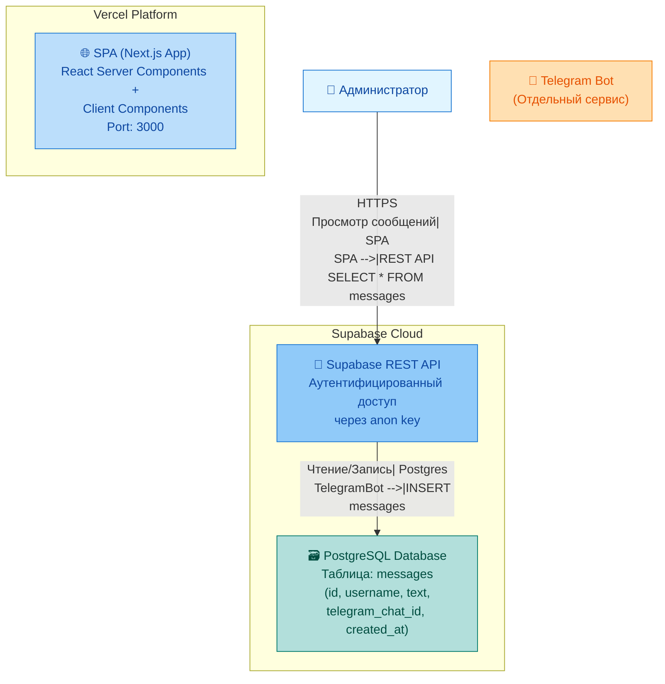
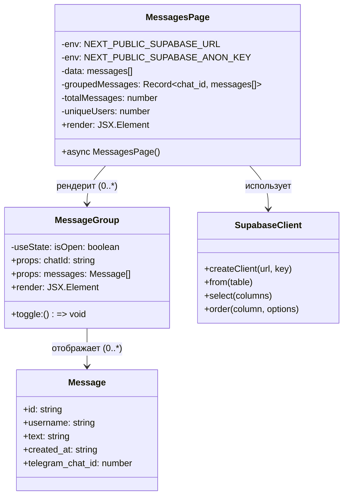

# C4 Диаграммы — VibecodeSupportBot (support-admin)

## Уровень 1: System Context Diagram (Контекстная диаграмма системы)

```mermaid
graph TB
    User["👤 Администратор<br/>(Оператор поддержки)"]
    AdminPanel["🖥️ Admin Panel<br/>Веб-приложение для просмотра<br/>сообщений поддержки"]
    Telegram["📱 Telegram Bot<br/>Бот поддержки"]
    Supabase["🗄️ Supabase<br/>Облачная БД и API"]
    Vercel["☁️ Vercel<br/>Платформа хостинга"]

    User -->|"Использует через браузер| AdminPanel
    Telegram -->|"Сохраняет сообщения| Supabase
    AdminPanel -->|"Читает сообщения из| Supabase
    AdminPanel -.->"|Развёрнут на| Vercel
    Supabase -.->"|Хранит данные| Telegram

    style User fill:#e1f5ff
    style AdminPanel fill:#85bbf9
    style Telegram fill:#ffb347
    style Supabase fill:#98d1c1
    style Vercel fill:#c9b3f9
```

---

## Уровень 2: Container Diagram (Диаграмма контейнеров)



---

## Уровень 3: Component Diagram (Диаграмма компонентов)

```mermaid
graph TB
    subgraph "support-admin (Next.js App)"
        Page["📄 MessagesPage<br/>(Server Component)<br/>src/app/page.tsx"]
        Layout["📐 RootLayout<br/>src/app/layout.tsx"]
        MessageGroup["💬 MessageGroup<br/>(Client Component)<br/>src/components/MessageGroup.tsx"]
        SupabaseClient["🔧 Supabase Client<br/>src/lib/supabase.ts"]
    end

    subgraph "Supabase"
        MessagesTable["📊 messages table<br/>(id, username, text,<br/>telegram_chat_id, created_at)"]
    end

    Layout -->|"Рендерит| Page
    Page -->|"Создаёт через| SupabaseClient
    SupabaseClient -->|"Запрос: .from('messages')<br/>.select('*')| MessagesTable
    Page -->|"Передаёт данные в| MessageGroup
    MessageGroup -->|"Отображает с<br/>группировкой по chat_id| User

    User["👤 Администратор"] -->|"Взаимодействует| MessageGroup

    style Page fill:#ffe0b2
    style Layout fill:#ffe0b2
    style MessageGroup fill:#c8e6c9
    style SupabaseClient fill:#bbdefb
    style MessagesTable fill:#98d1c1
    style User fill:#e1f5ff
```

---

## Уровень 4: Code/Class Diagram (Диаграмма кода)



---

## Описание уровней

### System Context (Уровень 1)
Показывает систему в целом и её взаимодействие с внешними акторами:
- **Администратор** — оператор поддержки, просматривающий сообщения
- **Admin Panel** — веб-приложение для мониторинга обращений
- **Telegram Bot** — отдельный сервис, получающий сообщения от пользователей
- **Supabase** — облачная БД, хранящая все сообщения
- **Vercel** — платформа развёртывания

### Container (Уровень 2)
Детализирует технологический стек:
- **Next.js App** — React-приложение с SSR/RSC, развёрнутое на Vercel
- **PostgreSQL** — таблица `messages` с полями: id, username, text, telegram_chat_id, created_at
- **Supabase REST API** — интерфейс для чтения данных
- **Telegram Bot** — внешний сервис, записывающий сообщения

### Component (Уровень 3)
Внутренняя структура приложения:
- **MessagesPage** — серверный компонент, загружает и группирует данные
- **MessageGroup** — клиентский компонент с accordion-логикой
- **Supabase Client** — обёртка над @supabase/supabase-js
- **RootLayout** — корневой layout с метаданными и шрифтами

### Code (Уровень 4)
Показывает ключевые сущности кода и их связи:
- Тип `Message` — контракт данных
- `MessagesPage` — асинхронный серверный компонент
- `MessageGroup` — интерактивный клиентский компонент
- `SupabaseClient` — singleton для доступа к БД

---

## Технологический стек

| Категория | Технология |
|-----------|-------------|
| Фреймворк | Next.js 16.2.2 |
| UI | React 19.2.4 |
| Стилизация | TailwindCSS 4 |
| БД | Supabase (PostgreSQL) |
| Хостинг | Vercel |
| Язык | TypeScript 5 |
